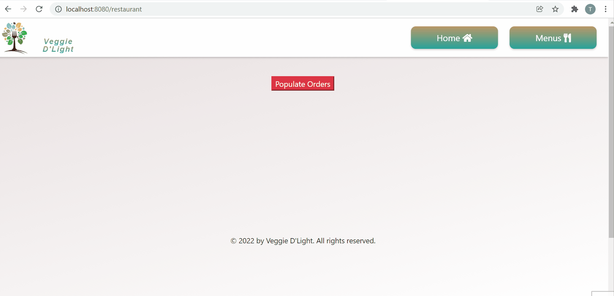

# LightCafe

 **LightCafe** is a food pick-up ordering app that uses Twilio to connect customers to the restaurant. Customers can visit the Menu Page to select menu items and add them to their cart. On the order page, they can review the order and enter their name and phone number to confirm the order. Once the 'Checkout' button is pressed, both the restaurant and the customer receive text notifications to confirm their order. 

 The admin or restaurant owner can navigate to their restaurant’s active order page that allows the restaurant to update order completion status. Once the order is ready for pick-up, the restaurant can remove the order by pressing 'Finish' button, the customer is then notified by text message that their order is ready for pick-up. 

- Backend was built using Node.js, Express, and PostreSQL
- Front-end was built with Javascript, EJS, and HTML/CSS
- The Twilio API was used to send text messages to the customer and the restaurant    

 ## Product Demo

## Project Setup

1. git clone git@github.com:t-tasmin/LightCafe.git   
This will create a folder LightCafe on your local directory.

2. You'll need to sign up for a Twilio trial account at https://www.twilio.com/ and create a phone number.

3. Create the .env by using .env.example as a reference: cp .env.example .env

4. Update the .env file with your correct local information:
    username: your username
    password: your password
    database: database name
    TWILIO_ACCOUNT_SID = 'Get from Twilio'
    TWILIO_AUTH_TOKEN = 'Get from Twilio'
    TWILIO_NUMBER = 'Get from Twilio'

5. Install dependencies: npm i

6. Fix to binaries for sass: npm rebuild node-sass

7. Reset database: npm run db:reset
 
8. Run the server: npm run local

9. Visit http://localhost:8080/
